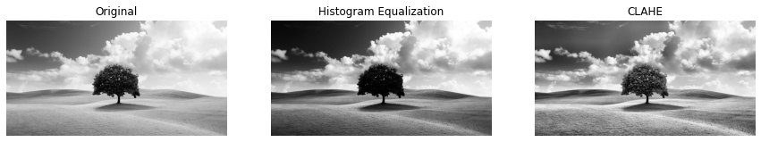

---
# 直方图均匀化，CLAHE和Gamma处理项目
## Github地址
Github地址：[AdvancedCD](https://github.com/MushroomLos/AdvancedCV/tree/master)

## 运行环境
- Python版本：3.6.15
- 需要的库及版本：
  - numpy 1.19.5：用于数组操作。
  - matplotlib 3.3.4：用于图像显示。
  - cv2 3.3.1：用于图像展示和处理。

## 使用方法

本项目包括三个主要的函数：`histogram_equalization`， `clahe`， `gamma_correction`。每个函数都接收图像数据作为输入，并返回处理后的图像。`compare_images`函数则会将传入的图像进行排列展示。

### 直方图均匀化处理
```python
orig_image, equalized_image = histogram_equalization(image)
```

- `image`：传入的灰度或彩色图像。

该函数会调用`cv2.equalizeHist`函数，并传入我们`image`的原始图像，之后返回`orig_image`和`equalized_image`两个图像。

### CLAHE方法

```python
orig_image, gamma_corrected_image = gamma_correction(image)
```

- `image`：传入的灰度或彩色图像。
- `clip_limit`：CLAHE的裁剪限制值，默认为2.0。
- `tile_grid_size`：直方图均匀化的网格大小，默认为(8, 8)。

该函数会调用首先通过`cv2.createCLAHE`函数创建一个`clahe`对象，并通过它的`apply`方法将其应用到我们的原始图像上，之后返回`orig_image`和`equalized_image`两个图像。

### gamma矫正

```python
orig_image, equalized_image = histogram_equalization(image, gamma)
```

- `image`：传入的灰度或彩色图像。
- `gamma`：目标gamma值。

该函数会首先获得传入`gamma`值的倒数`invGamma`，为了保留原图的效果，我们通过设定一张大小为256的向量，并对其中每个位置上的元素进行矫正，最终获得`table`表。之后我们通过`cv2.LUT`方法，传入`orig_image`和`table`两个参数，通过查表得方式进行映射，最终得到gamma矫正得图像

### 比较函数
```python
compare_images(results, titles)
```

- `results`：用于展示和比较的图像列表。
- `titles`：每一个图像的标题。
- `figsize`：plt中展示的图像大小，默认为(15, 5)。

接收参数后，按照`results`和`titles`的结果创建子图并显示。

## 输入输出

- 图像1直方图均匀化与CLAHE


- 图像2直方图均匀化与CLAHE


- 图像3直方图均匀化与CLAHE


- 图像1使用gamma矫正


- 图像2使用gamma矫正


- 图像3使用gamma矫正


## 结论

1. **直方图均匀化与CLAHE处理对比：**
   - 直方图均匀化作用于整个图像，提高整体对比度，但可能会导致图像的部分区域过度曝光或过于暗淡。
   - CLAHE专注于图像的局部区域，提高局部对比度，从而更细致地增强图像细节，避免了直方图均匀化可能导致的问题。

2. **Gamma矫正的影响：**
   - 当Gamma值小于1时，矫正后的图像在暗区域的细节会被增强，而亮区域的细节可能会丢失。
   - 当Gamma值大于1时，图像的亮区域细节得到增强，而暗区域则变得更暗，细节可能会降低。

3. **CLAHE与Gamma矫正效果对比：**
   - CLAHE更适合于增强局部对比度和细节，尤其是在存在不均匀光照的图像中表现更佳。
   - Gamma矫正主要影响图像的整体亮度和对比度，可以调整整体或特定区域的亮度，但不如CLAHE在局部细节增强上有效。
   - 在分析至少三幅图像的处理结果时，可以观察到CLAHE在细节上的优势，而Gamma矫正则提供了不同亮度级别下的视觉效果改善。